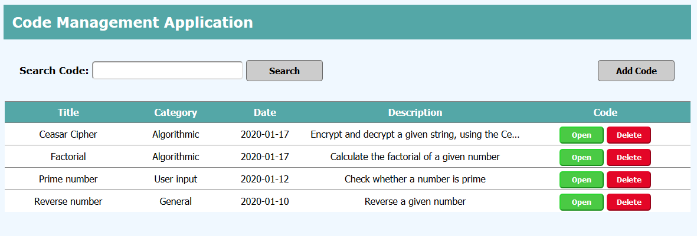

# Code Database Application
<b>Description:</b>

A code management application that uses an HTTP server and an SQL database, performing 
CRUD operations.  The user has the ability to store files providing a description, 
open/download the files and search the records with the use of keywords.
  
<b>Technologies used:</b>
 
<ol>
	<li>Spring MVC</li>
	<li>JSP</li>
	<li>Servlet</li>
	<li>Hibernate</li>
	<li>MySQL database</li>
	<li>Apache Tomcat</li>
</ol>

  

	<kbd></kbd>
	  
	<b>Image 1 - List Code Records</b>

  
  

	<kbd></kbd>
	  
	<b>Image 2 - Add Code</b>

  
  

	<kbd></kbd>
	  
	<b>Image 3 - Update / View Code</b>

  
  

	<kbd></kbd>
	  
	<b>Image 4 - Delete Code</b>

  
  